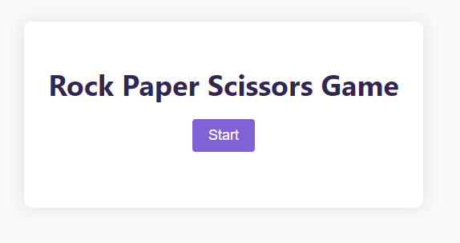
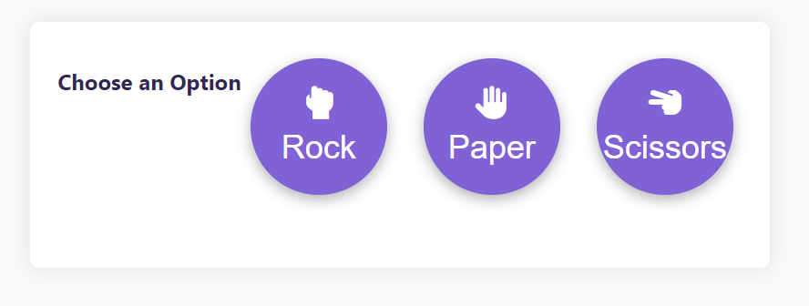

# Rock Paper Scissors Game

The Rock Paper Scissors Game is a classic hand game where you get to compete against the computer in a series of rounds. Choose your option (rock, paper, or scissors) and see if you can beat the computer's choice!

## How to Play

1. Click the "Start" button to begin the game.
2. In each round, click one of the three options (rock, paper, or scissors) to make your choice.
3. The computer will randomly pick its option as well.
4. After each round, the result will be displayed, indicating whether you won, lost, or it's a tie.
5. The game consists of a total of 5 rounds.
6. After completing 5 rounds, the final result will be shown.

## Technologies Used

- HTML
- CSS
- JavaScript
- Font Awesome icons

## How to Run

1. Clone this repository to your local machine using `git clone`.
2. Open the `index.html` file in your preferred web browser.
3. Click the "Start" button to begin the game.
4. Enjoy playing Rock Paper Scissors against the computer!

## Screenshots

## Contributing

Contributions are welcome! If you find any issues or want to add new features, feel free to open an issue or submit a pull request.

## License

This project is licensed under the [MIT License](LICENSE).

## Acknowledgments

- Inspired by the classic Rock Paper Scissors game.

---

Thank you for checking out the Rock Paper Scissors Game! Have fun playing, and may the odds be in your favor! 😄
